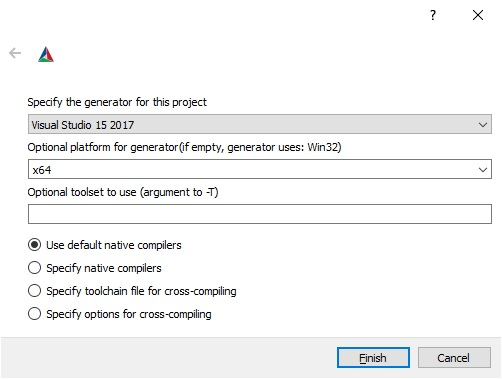

# Stereolabs ZED - C# API (beta)

This repository shows how to use the ZED SDK functionalities in C#.

## Getting started

- First, download the latest version of the ZED SDK on [stereolabs.com](https://www.stereolabs.com/developers/release/).
- For more information, read the ZED [API documentation](https://www.stereolabs.com/docs/api/index.html).

## Prerequisites

- **Windows** 10 64bits or later
- Visual Studio 2017 with C# extensions
- Cmake 3.8 at least (Support of C#)
- [ZED SDK **3.3**](https://www.stereolabs.com/developers/release/) and its dependency ([CUDA](https://developer.nvidia.com/cuda-downloads))

## Instructions

The C++ to C# is done the following way :

- A C interface to the ZED SDK is provided (*sl_zed_interface.dll*, currently built for ZED SDK 3.3).
- A .NET wrapper `Stereolabs.zed` that imports the functions from the dll interface.

Both dll are automatically added into the build folder as a NuGet package. There is no need to build them anymore.

- You can then use the functions of the .NET wrapper in your program.

### Build the tutorials

1. Enter the tutorials folder and generate the Tutorials solution using cmake.
**Use Visual studio 2017** (at least) compiler in **x64** mode.

2. Press configure and generate.
3. Open Tutorials.zed.sln solution and build the solution.

### Deployment

When the program is built, *Stereolabs.zed.dll* and *sl_zed_interface.dll* will be automatically copied into the build foldery.
When deploying the application, make sure that *sl_zed_interface.dll* and *Stereolabs.zed.dll* are packaged with the executable files, and shipped on a target PC that has the proper ZED SDK version installed.